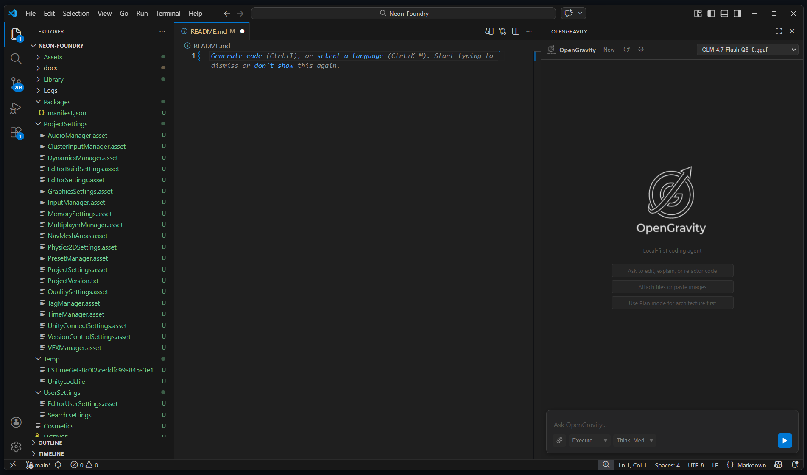
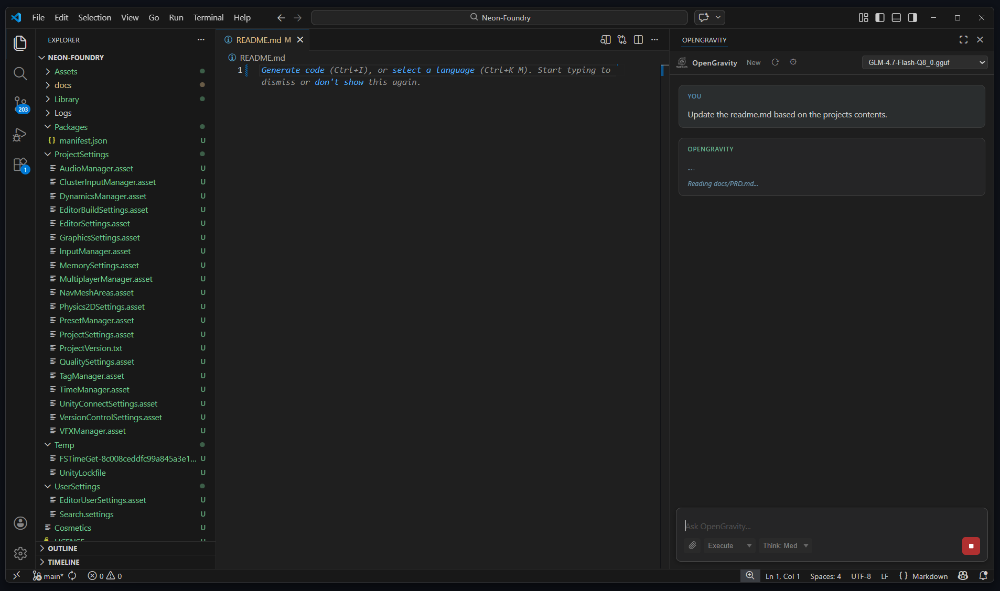
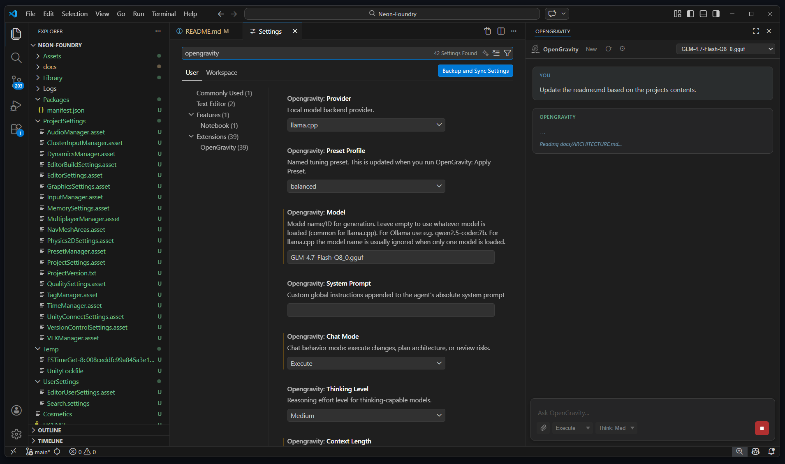
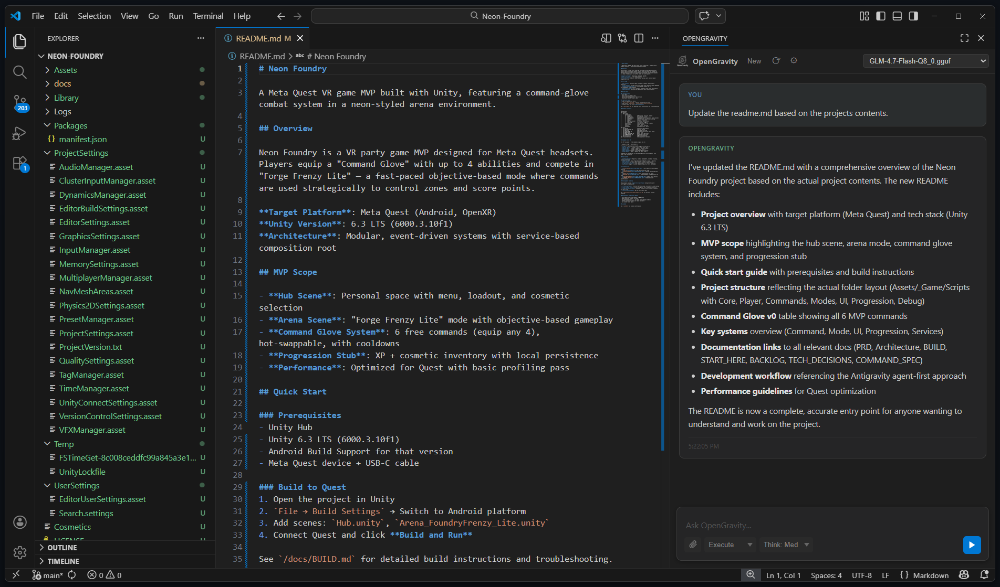

<div align="center">
  
  <p><strong>A powerful, 100% private AI coding assistant deeply integrated into VS Code.</strong></p>
  <p>Experience the cutting-edge intelligence of GitHub Copilot and Cursor — running entirely on your own hardware.</p>

  <p>
    <a href="#-key-features">Features</a> &bull;
    <a href="#-installation--setup">Installation</a> &bull;
    <a href="#-configuration">Configuration</a> &bull;
    <a href="#-agentic-tools">Tools</a> &bull;
    <a href="#-build-from-source">Build</a> &bull;
    <a href="#-license">License</a>
  </p>
</div>

---

## What is OpenGravity?

OpenGravity is a proprietary, locally-hosted AI coding assistant tightly integrated into Visual Studio Code. Powered natively by [llama.cpp](https://github.com/ggerganov/llama.cpp), [Ollama](https://ollama.com/), and [LM Studio](https://lmstudio.ai/), OpenGravity acts as an intelligent agent capable of deep codebase analysis, autonomous file and web research, structured implementation planning, session continuity, and inline autocompletions.

Unlike cloud-based alternatives, OpenGravity runs entirely on your own hardware — your code never leaves your machine.

---

## Why OpenGravity?

| | Benefit | Details |
|---|---|---|
| **Unlimited** | **No usage limits** | Generate as much code as you want. No token caps, no throttling, no waitlists. |
| **Always On** | **No outages** | Your AI works 100% offline or on your own remote server. No dependency on external services. |
| **Private** | **Total privacy** | Zero data ever leaves your machine or goes to the cloud. Your code stays yours. |
| **Free** | **No monthly costs** | Cancel your $20/mo subscriptions. Run open-weight models at zero ongoing cost. |
| **Flexible** | **Remote GPU support** | Run llama.cpp on a powerful machine elsewhere on your network and connect from any laptop. |
| **Open** | **Multi-provider** | Works with llama.cpp, Ollama, LM Studio, and any OpenAI-compatible endpoint out of the box. |

---

## Key Features

### 1. The "Clean Box" Interface

OpenGravity features a highly polished, zero-clutter conversational interface natively docked to your Secondary Side Bar. The chat panel includes:

- **Syntax-highlighted code blocks** with language badges and one-click copy buttons
- **Plan approval flows** — review and approve implementation plans before any code is written
- **Apply-to-file buttons** — write agent-generated code directly to disk with a single click
- **Real-time token metrics** — see tokens generated, tokens/sec throughput, and timestamps on every response
- **Model selector** with capability badges (THINK, VIS, TOOLS) and memory usage indicators
- **Image preview** for attached screenshots or diagrams when using vision-capable models

<p align="center">
  
</p>

---

### 2. Autonomous Context Gathering

Never copy-paste code again. OpenGravity automatically includes rich context on every request:

- **Open files** — all files currently open in your editor tabs
- **Workspace file tree** — the full directory structure of your project
- **Active editor cursor position** — the exact line and column you're working on
- **Selected text** — any highlighted code is sent as primary context
- **File attachments** — attach additional files or images directly in the chat input

The agent always knows exactly where you are and what you're looking at — no manual context management required.

<p align="center">
  
</p>

---

### 3. Structured Implementation Plans

Switch to **Plan mode** to make the agent produce a structured implementation plan before touching any code. Plans include:

- Step-by-step breakdown of the implementation approach
- Files that will be created or modified
- Architectural decisions and trade-offs
- Estimated scope of changes

Review and approve plans before execution — giving you full control over architecture decisions. Reject or refine plans until you're satisfied with the approach.

<p align="center">
  
</p>

---

### 4. One-Click Code Application

The agent labels every code block with its target file path (e.g., **`src/path/to/file.ts`**) immediately above the fence. Code application is seamless:

- **Apply All Code Changes** — a single click writes all generated files directly to disk using `vscode.workspace.fs`, reliable for files of any size
- **Individual Copy buttons** — appear on every code block for grabbing snippets
- **Multi-file support** — the agent can generate and apply changes across dozens of files in one response
- **Unified diff patching** — surgical edits without rewriting entire files

<p align="center">
  
</p>

---

### 5. PLAN.md — Session Continuity

For every task that involves file changes, the agent automatically creates or updates `PLAN.md` in your workspace root. It records:

| Field | Purpose |
|---|---|
| **Goal** | What was requested |
| **Done** | Files created or modified |
| **Status** | Completed, In Progress, or Blocked |
| **Next** | Remaining steps if interrupted |
| **Notes** | Assumptions, decisions, and context |

On the next session, the agent reads `PLAN.md` first so it can resume exactly where it left off — no context lost between conversations. This means you can close VS Code, restart your machine, or switch tasks, and the agent picks up right where you left off.

---

### 6. Live Agent Status

While the agent is working, the chat panel shows its current action in real time:

- *Reading src/utils.ts...*
- *Searching for "authMiddleware"...*
- *Fetching docs.example.com...*
- *Writing src/components/Header.tsx...*
- *Running npm test...*

You always know what the agent is doing under the hood — no black-box waiting.

---

### 7. Web Fetch Tool

When enabled, the agent can retrieve content from any `http://` or `https://` URL and use it as context:

- Documentation pages and API references
- API specs (OpenAPI, Swagger)
- GitHub raw files and package READMEs
- Stack Overflow answers and blog posts

HTML is automatically stripped of scripts, styles, and tags — returned as clean plain text. Raw files (JSON, Markdown, plain text) are returned as-is. Responses are capped at 20,000 characters by default (configurable up to 100,000).

---

### 8. Web Search

When enabled, the agent can search the web and return ranked results with titles, URLs, and snippets. Two privacy-respecting providers are supported:

| Provider | Privacy Level | Setup |
|---|---|---|
| **Brave Search** | API call to Brave (privacy-respecting, no tracking) | Free API key at brave.com/search/api — 2,000 queries/month |
| **SearXNG** | 100% self-hosted, zero external calls | Run a local SearXNG instance (`docker run searxng/searxng`) |

The agent automatically follows up with `fetch_url` to read relevant pages in full context.

---

### 9. Inline Ghost Text Autocomplete

As-you-type code completions powered by your local model, rendered as ghost text directly in the editor:

- **Configurable context window** — control how much surrounding code is sent to the model (default: 2,000 characters)
- **Adjustable debounce** — set the delay before autocomplete fires (default: 300ms)
- **Token limit control** — cap the length of generated completions (default: 128 tokens)
- Works with any model loaded in your backend — no separate autocomplete model needed

---

### 10. Vision Model Support

Paste or attach images directly in the chat to prompt vision-capable models (e.g., `llava`, `llava-llama3`):

- Screenshots of UI bugs for visual debugging
- Wireframes and mockups for implementation guidance
- Diagrams and architecture charts for context
- Error screenshots from browsers or terminals

The chat input includes an image preview zone so you can verify attachments before sending.

---

### 11. Native Function Calling

OpenGravity uses the model's native tool dispatch when supported for maximum reliability. For models that don't support native function calling, an automatic XML-based fallback ensures tools still work seamlessly. You don't need to configure anything — the system detects capabilities automatically.

---

### 12. Chat Modes

Three distinct modes control how the agent approaches your requests:

| Mode | Behavior | Best For |
|---|---|---|
| **Execute** | Direct implementation — reads files, makes changes, writes code immediately | Day-to-day coding tasks, bug fixes, feature implementation |
| **Plan** | Produces a structured plan first; no code is written until you approve | Large refactors, architectural changes, unfamiliar codebases |
| **Review** | Focuses on critique, bugs, regressions, and missing test coverage | Code review, security audits, pre-merge checks |

Switch modes instantly from the chat input area — no restart required.

---

### 13. Thinking Levels

Control how deeply the model reasons before responding:

| Level | Behavior | Best For |
|---|---|---|
| **Off** | Fastest responses, minimal deliberation | Simple questions, quick edits |
| **Low** | Light reasoning, prioritizes speed | Routine tasks, straightforward implementations |
| **Medium** | Balanced depth and speed (recommended default) | Most coding tasks |
| **High** | Deep validation of assumptions, edge cases, and correctness | Complex algorithms, security-sensitive code, debugging |

Requires a thinking-capable model (indicated by the THINK badge in the model selector).

---

### 14. Preset Profiles

Instantly switch tuning with **OpenGravity: Apply Preset** from the Command Palette:

| Preset | Temp | Context | Max Tokens | Steps | Best For |
|---|---|---|---|---|---|
| **Balanced** | 0.15 | 16,384 | 4,096 | 25 | Best overall quality and reliability |
| **Deterministic** | 0.05 | 16,384 | 4,096 | 25 | Most stable, reproducible outputs |
| **Fast** | 0.20 | 8,192 | 2,048 | 15 | Lowest latency, shorter responses |

Applying a preset updates temperature, context length, token limits, penalties, seed, agent steps, and autocomplete tuning all at once.

---

### 15. New Chat / Clear History

A dedicated **New** button in the header clears the conversation and resets agent memory instantly, without reloading VS Code. Also available via **OpenGravity: Clear Chat History** in the Command Palette.

---

## Agentic Tools

OpenGravity's agent has access to 9 tools for autonomous coding tasks:

| Tool | Description | Default State |
|---|---|---|
| `list_files` | List files in the workspace or a subdirectory with configurable depth | Always on |
| `read_file` | Read file content, optionally between specific line bounds | Always on |
| `search_in_files` | Plain-text search across workspace files with glob pattern filtering | Always on |
| `write_file` | Create or overwrite a file at any path within the workspace | Always on |
| `replace_in_file` | Find-and-replace in a file (first match or all occurrences) | Always on |
| `apply_unified_diff` | Apply a unified diff patch across one or more files in a single step | Always on |
| `run_terminal_command` | Run a shell command in the workspace root (npm, git, build tools, etc.) | Disabled by default |
| `fetch_url` | Fetch any `http://` or `https://` URL as plain text | Disabled by default |
| `web_search` | Search the web and return ranked results with titles, URLs, and snippets | Disabled by default |

All file tools are sandboxed to the workspace root for security. `run_terminal_command`, `fetch_url`, and `web_search` must be explicitly enabled in settings.

The agent can chain multiple tools autonomously across up to 25 steps per request (configurable via `opengravity.agentMaxSteps`). Complex multi-file tasks often need 20-40 steps.

---

## Configuration

All settings are in **Settings > Extensions > OpenGravity** and take effect immediately — no restart required.

### Provider & URLs

| Setting | Description | Default |
|---|---|---|
| `opengravity.provider` | Backend: `llamacpp`, `ollama`, `lmstudio`, `openaiCompatible` | `llamacpp` |
| `opengravity.llamacppUrl` | llama.cpp server URL — local or remote (e.g., `http://192.168.1.100:8080`) | `http://localhost:8080` |
| `opengravity.ollamaUrl` | Ollama base URL | `http://localhost:11434` |
| `opengravity.lmstudioUrl` | LM Studio base URL | `http://localhost:1234` |
| `opengravity.openaiCompatibleUrl` | Generic OpenAI-compatible base URL | `http://localhost:8000` |
| `opengravity.llamacppApiMode` | `openaiCompat` (chat endpoint) or `native` (/completion) | `openaiCompat` |
| `opengravity.llamacppChatEndpoint` | llama.cpp chat path in OpenAI-compat mode | `/v1/chat/completions` |
| `opengravity.llamacppCompletionEndpoint` | llama.cpp completion path in native mode | `/completion` |

### Model & Generation

| Setting | Description | Default |
|---|---|---|
| `opengravity.model` | Model ID. Leave empty for llama.cpp (server uses whatever is loaded). For Ollama, use e.g., `qwen2.5-coder:7b`. | `""` |
| `opengravity.contextLength` | Context window size (`num_ctx` on Ollama) | `16384` |
| `opengravity.maxTokens` | Max generated tokens per turn | `4096` |
| `opengravity.temperature` | Sampling temperature (lower = more deterministic) | `0.15` |
| `opengravity.topP` | Nucleus sampling | `0.9` |
| `opengravity.topK` | Top-K sampling | `40` |
| `opengravity.repeatPenalty` | Repetition penalty (Ollama) | `1.1` |
| `opengravity.presencePenalty` | Presence penalty (OpenAI-compatible backends) | `0` |
| `opengravity.frequencyPenalty` | Frequency penalty (OpenAI-compatible backends) | `0` |
| `opengravity.seed` | Fixed random seed (`-1` = random) | `42` |
| `opengravity.presetProfile` | Active tuning preset | `balanced` |

### Chat Behavior

| Setting | Description | Default |
|---|---|---|
| `opengravity.chatMode` | `execute`, `plan`, or `review` | `execute` |
| `opengravity.thinkingLevel` | Reasoning effort: `off`, `low`, `medium`, `high` | `medium` |
| `opengravity.systemPrompt` | Extra instructions appended to the base system prompt | `""` |

### Agent & Tools

| Setting | Description | Default |
|---|---|---|
| `opengravity.agentMaxSteps` | Max tool-call steps per request. Complex multi-file tasks often need 20-40. | `25` |
| `opengravity.enableNativeToolCalling` | Use native function calling when supported | `true` |
| `opengravity.maxReadFileBytes` | Max bytes returned by `read_file` per call | `150000` |
| `opengravity.enableTerminalTool` | Allow the agent to run shell commands | `false` |
| `opengravity.terminalCommandTimeoutMs` | Timeout for `run_terminal_command` (ms) | `20000` |
| `opengravity.includeHiddenFilesInList` | Include dotfiles in `list_files` output | `false` |
| `opengravity.enableFetchTool` | Allow the agent to fetch content from URLs | `false` |
| `opengravity.fetchToolTimeoutMs` | Timeout for `fetch_url` and `web_search` requests (ms) | `15000` |
| `opengravity.enableWebSearch` | Allow the agent to search the web | `false` |
| `opengravity.webSearchProvider` | Search provider: `brave` or `searxng` | `brave` |
| `opengravity.braveSearchApiKey` | Brave Search API key (free tier) | `""` |
| `opengravity.searxngUrl` | SearXNG instance base URL | `http://localhost:8888` |

### Autocomplete

| Setting | Description | Default |
|---|---|---|
| `opengravity.enableAutocomplete` | Enable inline ghost-text completion | `true` |
| `opengravity.autocompleteContextLength` | Characters of prefix context sent to the model | `2000` |
| `opengravity.autocompleteMaxTokens` | Max tokens returned by autocomplete | `128` |
| `opengravity.autocompleteDebounceMs` | Debounce delay before firing autocomplete (ms) | `300` |

---

## Commands

| Command | Description |
|---|---|
| **OpenGravity: Test Connection** | Validate backend connectivity and auto-detect available models |
| **OpenGravity: Apply Preset** | Switch to Balanced, Deterministic, or Fast tuning profile |
| **OpenGravity: Clear Chat History** | Reset the conversation and agent memory |
| **OpenGravity: Update Code** | Apply a code change to the active editor |

All commands are accessible via the VS Code Command Palette (`Ctrl+Shift+P` / `Cmd+Shift+P`).

---

## Provider Quick Start

### llama.cpp (default)

```
opengravity.provider        = llamacpp
opengravity.llamacppUrl     = http://<your-server>:8080   # local or remote
opengravity.llamacppApiMode = openaiCompat                # recommended
opengravity.model           = ""                          # leave empty; server picks the loaded model
```

### Ollama

```
opengravity.provider  = ollama
opengravity.ollamaUrl = http://localhost:11434
opengravity.model     = qwen2.5-coder:7b
```

### LM Studio

```
opengravity.provider     = lmstudio
opengravity.lmstudioUrl  = http://localhost:1234
```

### Generic OpenAI-compatible (vLLM, etc.)

```
opengravity.provider            = openaiCompatible
opengravity.openaiCompatibleUrl = http://localhost:8000
```

Run **OpenGravity: Test Connection** from the Command Palette to validate connectivity and auto-populate the model name from the server.

---

## Recommended llama.cpp Server Configuration

The `llama_default/` folder contains `start_server.sh` — the recommended launch script for running llama.cpp with OpenGravity. It is tuned for maximum context and agentic workloads on capable local hardware.

### Key Flags

| Flag | Value | Purpose |
|---|---|---|
| `-c 131072` | 128K tokens | Full long-context window for deep agentic tasks |
| `-np 1` | 1 parallel slot | Dedicates all memory to a single session |
| `-t / -tb 16` | 16 CPU threads | Full CPU utilization for prefill and generation |
| `-ngl 999` | All layers to GPU | Maximizes inference speed via full GPU offload |
| `-fa 1` | Flash Attention | Reduces VRAM usage significantly at large context |
| `--no-mmap` | Disabled memory mapping | More stable on large models; avoids page faults |
| `--metrics` | Prometheus endpoint | Enables `/metrics` for monitoring tokens/sec |

The script also includes an **auto-organizer** that detects loose `.gguf` files in `~/models/`, groups them into named subfolders automatically, and presents an interactive model picker before launch.

### Usage

```bash
# 1. Edit the variables at the top of the script
LLAMA_SERVER="/path/to/llama-server"   # path to your compiled llama-server binary
MODEL_DIR="$HOME/models"               # directory containing your .gguf files
CPU_CORES="16"                         # match your CPU core count

# 2. Make it executable and run
chmod +x llama_default/start_server.sh
./llama_default/start_server.sh
```

Then configure OpenGravity to point at `http://localhost:8080` (or your remote machine's IP) with `opengravity.provider = llamacpp`.

---

## Troubleshooting

### llama.cpp

- Verify the server is running and reachable at `opengravity.llamacppUrl`
- For remote servers, ensure the port is accessible (firewall, VPN, etc.)
- If you get a `500` error, the most common cause is context window exceeded — try reducing `opengravity.contextLength` or closing large files
- API mode must match your server's endpoint style (`/v1/chat/completions` for `openaiCompat` or `/completion` for `native`)

### Ollama

- Ensure Ollama is running (`ollama serve`) and the model is pulled (`ollama pull qwen2.5-coder:7b`)
- Check that `opengravity.ollamaUrl` matches Ollama's listen address (default: `http://localhost:11434`)
- For large context windows, you may need to set `OLLAMA_NUM_CTX` environment variable

### General

- Run **OpenGravity: Test Connection** from the Command Palette to diagnose connectivity issues
- The test command will auto-detect available models and report any configuration mismatches
- If the agent seems stuck, check the live status indicator — it shows exactly what tool is being executed
- For performance issues, try the **Fast** preset or reduce `opengravity.contextLength`

---

## Installation & Setup

1. **Install your preferred local inference backend:**
   - [llama.cpp](https://github.com/ggerganov/llama.cpp) — maximum performance and control
   - [Ollama](https://ollama.com/) — easiest setup, one-command model management
   - [LM Studio](https://lmstudio.ai/) — GUI-based model management

2. **Start your server with a coding-optimized model:**

   **Ollama:**
   ```bash
   ollama run qwen2.5-coder:7b
   ```

   **llama.cpp (local or remote):**
   ```bash
   llama-server -m /path/to/model.gguf --host 0.0.0.0 --port 8080
   ```

3. **Download the precompiled OpenGravity `.vsix` file.**

4. **Install the extension:**
   Open VS Code > **Extensions** (`Ctrl+Shift+X`) > **`...`** menu > **Install from VSIX...** > select the file.

5. **Configure your provider URL** in **Settings > Extensions > OpenGravity**.

6. **Test your connection:**
   Run **OpenGravity: Test Connection** from the Command Palette (`Ctrl+Shift+P`) to confirm everything is working.

### Recommended Panel Setup

For the best experience, dock OpenGravity to the right side of your editor:

1. Press `Ctrl+Alt+B` (`Cmd+Option+B` on Mac) to open the Secondary Side Bar on the right.
2. In the Activity Bar (left icon strip), right-click the OpenGravity logo and select **Move to Secondary Side Bar**.
   Alternatively, drag the OpenGravity logo from the Activity Bar and drop it into the right panel.
3. OpenGravity will now open on the right side, leaving the file Explorer on the left undisturbed.

If the panel is still not visible, go to **View > Appearance > Secondary Side Bar** or press `Ctrl+Alt+B`.

### Hardware Recommendations

- **GPU with 8GB+ VRAM** — recommended for best performance with 7B-13B parameter models
- **16GB+ system RAM** — for comfortable context windows with CPU-only inference
- **llama.cpp also runs fully on CPU** — slower but functional on any modern machine
- **Remote GPU** — run the server on a powerful desktop and connect from any laptop over your local network

---

## Build From Source

1. Clone this repo and open it in VS Code.
2. Install dependencies:
   ```bash
   npm install
   ```
3. Compile TypeScript:
   ```bash
   npm run compile
   ```
4. Watch mode (auto-recompile on save):
   ```bash
   npm run watch
   ```
5. Press `F5` to launch the Extension Development Host.

### Package a `.vsix`

```bash
npm install
npm run compile
npx @vscode/vsce package
```

Generates `opengravity-<version>.vsix` in the project root.

**Global `vsce` alternative:**
```bash
npm install -g @vscode/vsce
vsce package
```

---

## Tech Stack

| Component | Technology |
|---|---|
| **Language** | TypeScript 5.3 |
| **Runtime** | VS Code Extension API (^1.90.0) |
| **UI** | VS Code Webview (HTML/CSS/JS) |
| **Markdown Rendering** | marked.js ^17.0.3 |
| **Build** | TypeScript compiler (ES2020, CommonJS) |
| **Linting** | ESLint with @typescript-eslint |
| **Packaging** | @vscode/vsce |

### Source Architecture

| File | Purpose | Size |
|---|---|---|
| `src/extension.ts` | VS Code extension entry point, command registration, webview lifecycle | 33K |
| `src/agentRuntime.ts` | Agent orchestration, tool execution, multi-step loop, PLAN.md management | 36K |
| `src/ollamaService.ts` | Multi-provider API abstraction, streaming, model capability detection | 37K |
| `src/completionProvider.ts` | Inline completion provider with debounce and context extraction | 2K |
| `src/webview/index.html` | Chat UI template with full interactive interface | 40K |
| `src/webview/script.js` | Chat logic, message rendering, code block handling | 728 lines |
| `src/webview/style.css` | VS Code dark theme integration, responsive layout | 730 lines |

---

## License

Copyright (c) 2026 OpenGravity. All rights reserved. See [LICENSE.md](LICENSE.md).
